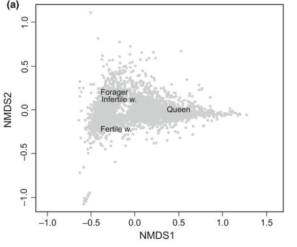
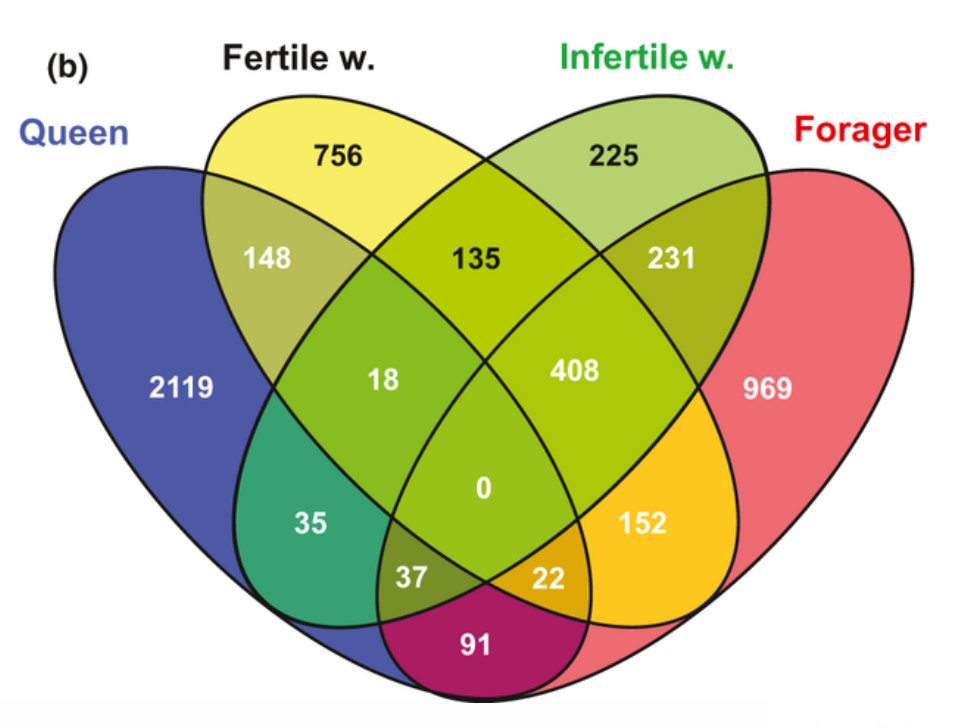
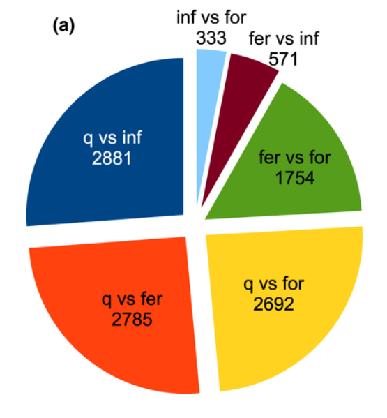
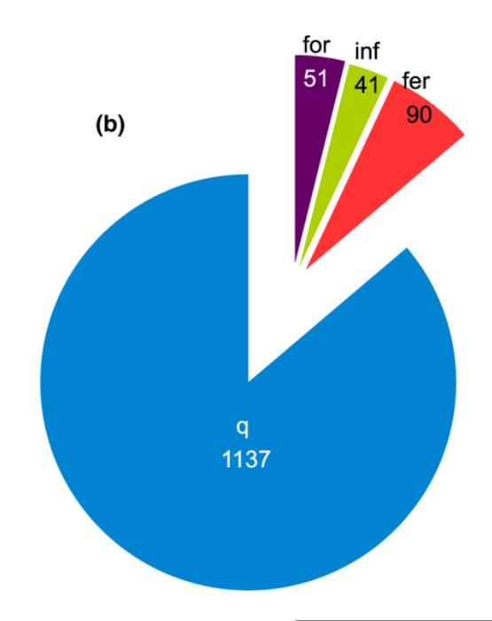
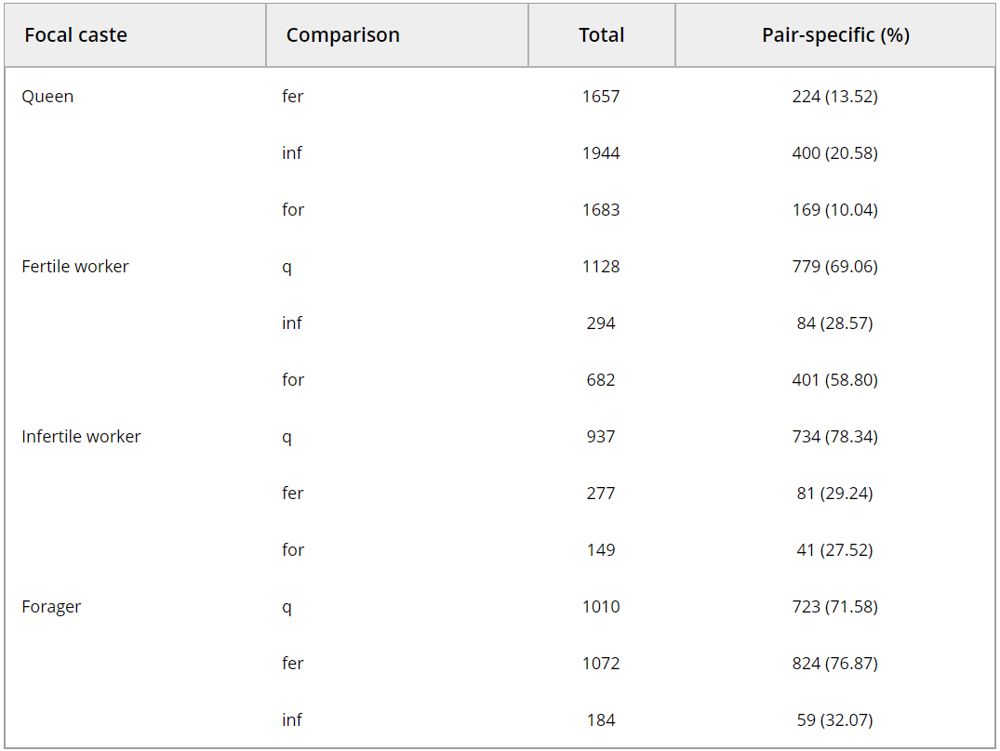
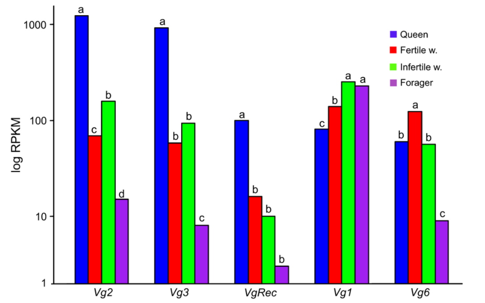

```{r}
library(ggplot2)
library(dplyr)
library(plyr)
library(vegan)
library(reshape2)
library(VennDiagram)
library(knitr)

```

# Replication of figures 1, 3, and 4 (and Table 1) of "Gene expression patterns associated with caste and reproductive status in ants: worker-specific genes are more derived than queen-specific ones" by Feldmeyer, Elsner, and Foitzik, 2013

## This paper involved sequencing total RNA from four different phenotypes of female ants that occur in colonies of *Temnothorax longispinosus* 
## This is interesting because ant colonies are composed of one or more queens and their numerous worker offspring, who are usually full-, or sometimes half-sibs in terms of parentage but who actually share 75% as opposed to 50% of their DNA with full-sibs due to haplodiploidy in ants. Nonetheless, these nearly identical genomes produce extremely different looking and behaving phenotypes, presumably based on patterns of gene expression.

###I downloaded the gene expression spreadsheet they published and converted to csv. To do this had to combine two different sheets, one with just the expression values, and one with the p and fold change values, within the overall excel file so I could just use the one csv for all analyses.

```{r}

a <- read.csv("mec12490-sup-0005-TableS3.csv", header = TRUE, sep = ",", stringsAsFactors = FALSE)

head(a)

```
## The four sampled categories of female are called queen, fertile (worker), infertile (worker), and forager (worker). The columns with those names display the reads-per-mapped-kilobase normalized expression values for the gene in each row. The columns including the word "fold" are the fold change between two categories that were compared according to their expression values. The columns containing "p" are the false discovery rate-corrected p values from Z tests comparing the expression values. The typical cutoff for significance many people (and these authors) use for gene expression is p < 0.05 and fold change > 2. A spreadsheet like this is produced series command-line based bioinformatics packages such as Tuxedo, which estimate expression levels for genes based on the population of sequence fragments resulting from sequencing that map to the gene in question. Because fragments are typically shorter than genes, complex statistics are used to estimate gene copy number (expression level) based on the makeup of the fragment population.

###Here I am renaming some of the columns for ease of use.

```{r}

names(a)
#the names are really long so I'm renaming the ones I need

colnames(a)[colnames(a)=="Feature.ID"] <- "ID"
colnames(a)[colnames(a)=="Annotations...RefSeq.protein.ID"] <- "annotation"
colnames(a)[colnames(a)=="queen...Q.RNA.Seq...RPKM"] <- "queen"
colnames(a)[colnames(a)=="fertile...FB1.RNA.Seq...RPKM"] <- "fertile"
colnames(a)[colnames(a)=="infertile...IFB1.RNA.Seq...RPKM"] <- "infertile"
colnames(a)[colnames(a)=="forager...W2.RNA.Seq...RPKM"] <- "forager"
colnames(a)[colnames(a)=="Kal.s.Z.test..queen.vs.fertile.original.values...FDR.p.value.correction"] <- "queenfertile_p"
colnames(a)[colnames(a)=="Kal.s.Z.test..queen.vs.fertile.original.values...Proportions.fold.change"] <- "queenfertile_fold"
colnames(a)[colnames(a)=="Kal.s.Z.test..queen.vs.infertile.original.values...Proportions.fold.change"] <- "queeninfertile_fold"
colnames(a)[colnames(a)=="Kal.s.Z.test..queen.vs.infertile.original.values...FDR.p.value.correction"] <- "queeninfertile_p"
colnames(a)[colnames(a)=="Kal.s.Z.test..queen.vs.forager.original.values...Proportions.fold.change"] <- "queenforager_fold"
colnames(a)[colnames(a)=="Kal.s.Z.test..queen.vs.forager.original.values...FDR.p.value.correction"] <- "queenforager_p"
colnames(a)[colnames(a)=="Kal.s.Z.test..fertile.vs.infertile.original.values...Proportions.fold.change"] <- "fertileinfertile_fold"
colnames(a)[colnames(a)=="Kal.s.Z.test..fertile.vs.infertile.original.values...FDR.p.value.correction"] <- "fertileinfertile_p"
colnames(a)[colnames(a)=="Kal.s.Z.test..fertile.vs.forager.original.values...Proportions.fold.change"] <- "fertileforager_fold"
colnames(a)[colnames(a)=="Kal.s.Z.test..fertile.vs.forager.original.values...FDR.p.value.correction"] <- "fertileforager_p"
colnames(a)[colnames(a)=="Kal.s.Z.test..infertile.vs.forager.original.values...Proportions.fold.change"] <- "infertileforager_fold"
colnames(a)[colnames(a)=="Kal.s.Z.test..infertile.vs.forager.original.values...FDR.p.value.correction"] <- "infertileforager_p"

names(a)

```


# Figure 1a, NMDS plot

### as published


## In this NMDS plot, all the genes that are significantly differentially expressed (p < 0.05 and fold change > 2) are plotted in four dimensions based on the four expression values each gene has for the four categories sampled, in a manner that should minimize "stress", or how hard it is for the compressed 2D plot to accurately depict the distances between the points. However, this NMDS particular plot does not result in finding a real minimum. The algorithm finds a somewhat low stress value to settle at but does not establish it as a minimum.

## The purpose of this figure is to illustrate any distinctive clusters of genes that appear, indicating differences in gene expression patterns associated with each phenotype. The distance between the red labels, which are actually calculated as "species scores", or weighted averages for all the expression values belonging to that category, illustrate roughly how different the sampled females are from each other under this mode of analysis.

```{r}

#filtering for genes that have p<0.05 and fc>2 for at least one of the six different pairwise comparisons. These genes are referred to as "DEGs", differentially expressed genes 
b <- filter(a, queenfertile_p<0.05 & abs(queenfertile_fold)>2 | queeninfertile_p<0.05 & abs(queeninfertile_fold)>2 | queenforager_p<0.05 & abs(queenforager_fold)>2 | fertileinfertile_p<0.05 & abs(fertileinfertile_fold)>2 | fertileforager_p<0.05 & abs(fertileforager_fold)>2 | infertileforager_p<0.05 & abs(infertileforager_fold)>2)

#selecting just the expression values
s <- mutate(b) %>% select(queen, fertile, infertile, forager)

#performing nmds
#s.mds <- metaMDS(s)

#s.mds

#plotting using points
#plot(s.mds, type = "p")

#My NMDS plot is almost exactly the same as the published one, but mine is rotated in the opposite orientation

#plotting using text to show that the red labels match up to their positions in the published figure.
#plot(s.mds, type = "t")


```
### When I filtered for genes that had p<0.05 and fc>2 for at least one of the six pairwise comparisons, I obtained an NMDS plot almost identical to the published version, except that it was rotated by a multiple of 90 degrees from the published orientation. This does not reflect any meaningful difference.

# Figure 1b, Venn diagram

### as published


## This Venn diagram is supposed to show the subsets of diffentially expressed genes that were expressed in the four different categories and how these lists overlap.

### The vegan package I (and the authors) used for the diagram outputs to a file, not directly to R, so I am embedding the resulting images below each attempt.

### My attempts to replicate this figure differed significantly from the published version due to the ambiguous language used to describe the selection criteria. It should depict "patterns of private and shared differentially expressed genes". These categories are defined: "differentially expressed genes (DEGs),which are either shared between castes or specificallyexpressed in only a single caste (private genes)". We know from figure 1a that DEGs are defined by p<0.05 and fc>2. However, this definition is complicated when it comes to whether the significant differences need to appear for just one pairwise comparison or need to appear in all the pairwise comparisons in which one caste is involved. I tried variations on both these ideas. 

### First, as in 1a, I first filtered all the DEGs in general, then filtered for which ones were expressed above zero in each caste to create the different Venn categories.
```{r}
# filtering for DEGs based on having just one pairwise comparison qualify as significant
b <- filter(a, queenfertile_p<0.05 & abs(queenfertile_fold)>2 | queeninfertile_p<0.05 & abs(queeninfertile_fold)>2 | queenforager_p<0.05 & abs(queenforager_fold)>2 | fertileinfertile_p<0.05 & abs(fertileinfertile_fold)>2 | fertileforager_p<0.05 & abs(fertileforager_fold)>2 | infertileforager_p<0.05 & abs(infertileforager_fold)>2)

#filtering for DEGs expressed above 0 in each caste
q_nonzero <- filter(a, queen != 0)
q_nonzero <- mutate(q_nonzero) %>% select(ID)

fert_nonzero <- filter(a, fertile != 0)
fert_nonzero <- mutate(fert_nonzero) %>% select(ID)

infert_nonzero <- filter(a, infertile != 0)
infert_nonzero <- mutate(infert_nonzero) %>% select(ID)

for_nonzero <- filter(a, forager != 0)
for_nonzero <- mutate(for_nonzero) %>% select(ID)

#creating the diagram
venn.diagram(list(Queen=q_nonzero$ID, Forager=for_nonzero$ID, Fertile=fert_nonzero$ID, Infertile=infert_nonzero$ID), "replication_venn0.tiff", fill = c("blue", "red", "yellow", "green"), cex=1.5,cat.cex=1.8) 
```


### This is VERY different from the published figure in that the most overlapping sections of the diagram have the highest numbers, with very few genes with the criteria used being expressed exclusively in individual castes. Therefore, I next tried testing for significance relative to the different categories in which each caste appeared; basically I filtered for significance relative to individual castes as opposed to in general. 

### I first tried selected DEGs for each caste that had a least one caste-specific pairwise comparison

```{r}
# filtering for at least one significant pairwise comparison for the set of comparisons involving the caste in question
q_nonzero <- filter(a, queen != 0 & ( queenfertile_p<0.05 & abs(queenfertile_fold)>2 | queeninfertile_p<0.05 & abs(queeninfertile_fold)>2 | queenforager_p<0.05 & abs(queenforager_fold)>2))
q_nonzero <- mutate(q_nonzero) %>% select(ID)

fert_nonzero <- filter(a, fertile != 0 & (queenfertile_p<0.05 & abs(queenfertile_fold)>2 | fertileinfertile_p<0.05 & abs(fertileinfertile_fold)>2 | fertileforager_p<0.05 & abs(fertileforager_fold)>2))
fert_nonzero <- mutate(fert_nonzero) %>% select(ID)

infert_nonzero <- filter(a, infertile != 0 & (fertileinfertile_p<0.05 & abs(fertileinfertile_fold)>2 | queeninfertile_p<0.05 & abs(queeninfertile_fold)>2 | infertileforager_p<0.05 & abs(infertileforager_fold)>2))
infert_nonzero <- mutate(infert_nonzero) %>% select(ID)

for_nonzero <- filter(a, forager != 0 & (infertileforager_p<0.05 & abs(infertileforager_fold)>2 | fertileforager_p<0.05 & abs(fertileforager_fold)>2 | queenforager_p<0.05 & abs(queenforager_fold)>2))
for_nonzero <- mutate(for_nonzero) %>% select(ID)


venn.diagram(list(Queen=q_nonzero$ID, Forager=for_nonzero$ID, Fertile=fert_nonzero$ID, Infertile=infert_nonzero$ID), "replication_venn1.tiff", fill = c("blue", "red", "yellow", "green"), cex=1.5,cat.cex=1.8) 
```


### This diagram looks more similar to my first attempt than to the one in the paper. There are still too many shared genes and not enough private genees.

### I next tried selecting caste-specific DEGs as above except that they had to be significant for all pairwise comparisons involving the caste in question.

```{r}
# filtering for significance in all pairwise comparisons for the set of comparisons involving the caste in question
q_nonzero <- filter(a, queen != 0 & queenfertile_p<0.05 & abs(queenfertile_fold)>2 & queeninfertile_p<0.05 & abs(queeninfertile_fold)>2 & queenforager_p<0.05 & abs(queenforager_fold)>2)
q_nonzero <- mutate(q_nonzero) %>% select(ID)

fert_nonzero <- filter(a, fertile != 0 & queenfertile_p<0.05 & abs(queenfertile_fold)>2 & fertileinfertile_p<0.05 & abs(fertileinfertile_fold)>2 & fertileforager_p<0.05 & abs(fertileforager_fold)>2)
fert_nonzero <- mutate(fert_nonzero) %>% select(ID)

infert_nonzero <- filter(a, infertile != 0 & fertileinfertile_p<0.05 & abs(fertileinfertile_fold)>2 & queeninfertile_p<0.05 & abs(queeninfertile_fold)>2 & infertileforager_p<0.05 & abs(infertileforager_fold)>2)
infert_nonzero <- mutate(infert_nonzero) %>% select(ID)

for_nonzero <- filter(a, forager != 0 & infertileforager_p<0.05 & abs(infertileforager_fold)>2 & fertileforager_p<0.05 & abs(fertileforager_fold)>2 & queenforager_p<0.05 & abs(queenforager_fold)>2)
for_nonzero <- mutate(for_nonzero) %>% select(ID)


venn.diagram(list(Queen=q_nonzero$ID, Forager=for_nonzero$ID, Fertile=fert_nonzero$ID, Infertile=infert_nonzero$ID), "replication_venn2.tiff", fill = c("blue", "red", "yellow", "green"), cex=3,cat.cex=1.8) 
```


### This attempt was more similar to the numbers in the published figure, but still off, so I also tried discarding the criterion of fc>2.

```{r}
# same filtering as above but only on the basis of p value
q_nonzero <- filter(a, queen != 0 & queenfertile_p<0.05 & queeninfertile_p<0.05 & queenforager_p<0.05)
q_nonzero <- mutate(q_nonzero) %>% select(ID)

fert_nonzero <- filter(a, fertile != 0 & queenfertile_p<0.05 & fertileinfertile_p<0.05 & fertileforager_p<0.05)
fert_nonzero <- mutate(fert_nonzero) %>% select(ID)

infert_nonzero <- filter(a, infertile != 0 & fertileinfertile_p<0.05 & queeninfertile_p<0.05 & infertileforager_p<0.05)
infert_nonzero <- mutate(infert_nonzero) %>% select(ID)

for_nonzero <- filter(a, forager != 0 & infertileforager_p<0.05 & fertileforager_p<0.05 & queenforager_p<0.05)
for_nonzero <- mutate(for_nonzero) %>% select(ID)


venn.diagram(list(Queen=q_nonzero$ID, Forager=for_nonzero$ID, Fertile=fert_nonzero$ID, Infertile=infert_nonzero$ID), "replication_venn3.tiff", fill = c("blue", "red", "yellow", "green"), cex=3,cat.cex=1.8) 
```


### This version appears slightly more similar to the paper, although only for certain numbers. It is unclear which of my attempts best replicate the language used in describing the figure and it is unclear why many of these attempts are far off. 

### I did not replicate figure 2 because the vast majority of the process behind that graph was not done in R. It needs to be done using BLASTx rather than R. Unfortunately the authors did not publish the raw results of the BLAST they did. 

# Figure 3a, pairwise pie

### as published


## This pie should show the subsets of differentially expressed genes that are statistically different based on p value and fold change between the different pairwise comparisons that can be made. 

### Again, my attempt here does not perfectly match the figure in the paper, although the pattern is similar. The language used in describing this figure is less ambiguous in my opinion, so I felt the only accurate way to filter would be to select genes with p<0.05 and fc>2 or fc<-2 (since a negative value would still be significant, just in the opposite direction; this was confirmed by the author) for the pairwise comparison in question.

```{r}
qfert <- filter(a, queenfertile_p<0.05 & abs(queenfertile_fold)>2)
qfert <- mutate(qfert) %>% select(ID)

qinfert <- filter(a, queeninfertile_p<0.05 & abs(queeninfertile_fold)>2)
qinfert <- mutate(qinfert) %>% select(ID)

qfor <- filter(a, queenforager_p<0.05 & abs(queenforager_fold)>2)
qfor <- mutate(qfor) %>% select(ID)

fertinfert <- filter(a, fertileinfertile_p<0.05 & abs(fertileinfertile_fold)>2)
fertinfert <- mutate(fertinfert) %>% select(ID)

fertfor <- filter(a, fertileforager_p<0.05 & abs(fertileforager_fold)>2)
fertfor <- mutate(fertfor) %>% select(ID)

infertfor <- filter(a, infertileforager_p<0.05 & abs(infertileforager_fold)>2)
infertfor <- mutate(infertfor) %>% select(ID)

#defining two vectors, one containing the number of genes filtered into each category, and one containing labels
slices <- c(nrow(qfert), nrow(qinfert), nrow(qfor), nrow(fertinfert), nrow(fertfor), nrow(infertfor)) 
lbls <- c("q vs. fer", "q vs. inf", "q vs. for", "fer vs. inf", "fer vs. for", "inf vs. for")
lbls <- paste(lbls, slices) # add percents to labels 

#defining a blank theme to use with the ggplot pie chart to remove the default extraneous visual features
blank_theme <- theme_minimal()+
  theme(
  axis.title.x = element_blank(),
  axis.title.y = element_blank(),
  panel.border = element_blank(),
  panel.grid=element_blank(),
  axis.ticks = element_blank(),
  plot.title=element_text(size=14, face="bold")
  )

#creating a small data frame from the vectors above to hand to ggplot
df <- data.frame(group = lbls, value = slices)

#plotting by converting a stacked bar graph into a polar coordinate circle to act as a pie chart
bp<- ggplot(df, aes(x="", y=value, fill=group))+ geom_bar(width = 1, stat = "identity")+ scale_fill_manual(values = c("q vs. fer 2783" = "orange", "q vs. inf 2919" = "navy", "q vs. for 2721" = "yellow", "fer vs. inf 579" = "red", "fer vs. for 457" = "green", "inf vs. for 338" = "blue"))

pie <- bp + coord_polar("y", start=45) + blank_theme + theme(axis.text.x=element_blank()) + geom_text(aes(x = 1.8, label = c("q vs. fer 2783", "q vs. inf 2919", "q vs. for 2721", "fer vs. inf 579", "fer vs. for 457", "inf vs. for 338")), size=3, position = position_stack(vjust = 0.5))
pie


```

### This pie chart is similar, but not identical to the published verion. However, the language did not seem to be able to be interpretted in any other way. Conversations with the authors confirmed that my interpretation of the fc criterion was correct. I did actually try to create this figure using only the p value criterion but it was even less accurate so I did not include it.

# Figure 3b, up-regulated pie

### as published


## This pie should show the subsets of differentially expressed genes that are uniquely upregulated in one category relative to all the others. These would suggest that these genes are fundementally important for creating the unique phenotype in question, probably being necessarily for developping certain structures needed for its behavior and role. 

### The language for this figure is completely ambiguous. In the caption it is described as "Number of caste-specific genes that are up-regulated in a single caste in comparison with all other castes", but in the body of the paper it is described as "genes that are exclusively regulated differentially in a single caste incomparison with all three other castes". Note that the first description implies upregulation, while the second description implies differential regulation, either up or down. Based on talking with the author, I was advised that the correct interpretation was to filter for upregulated genes specifically. However I included figures made using both interpretations below. 

```{r}
# filtering for significance (up OR down regulation) in all pairwise comparisons for the set of comparisons involving the caste in question based on both p value and fc
q_up <- filter(a, queenfertile_p<0.05 & abs(queenfertile_fold) > 2 & queeninfertile_p<0.05 & abs(queeninfertile_fold)>2 & queenforager_p<0.05 & abs(queenforager_fold)>2)

fert_up <- filter(a, queenfertile_p<0.05 & abs(queenfertile_fold) < 2 & fertileinfertile_p<0.05 & abs(fertileinfertile_fold)>2 & fertileforager_p<0.05 & abs(fertileforager_fold)>2)

infert_up <- filter(a, fertileinfertile_p<0.05 & abs(fertileinfertile_fold) < 2 & queeninfertile_p<0.05 & abs(queeninfertile_fold) < 2 & infertileforager_p<0.05 & abs(infertileforager_fold)>2)

for_up <- filter(a, infertileforager_p<0.05 & abs(infertileforager_fold) < 2 & fertileforager_p<0.05 & abs(fertileforager_fold) < 2 & queenforager_p<0.05 & abs(queenforager_fold) < 2)

#defining two vectors, one containing the number of genes filtered into each category, and one containing labels
slices <- c(nrow(q_up), nrow(fert_up), nrow(infert_up), nrow(for_up)) 
lbls <- c("q", "fer", "inf", "for")
lbls <- paste(lbls, slices) # add percents to labels 

#creating a small data frame from the vectors above to hand to ggplot
df <- data.frame(group = lbls, value = slices)

#plotting by converting a stacked bar graph into a polar coordinate circle to act as a pie chart
bp<- ggplot(df, aes(x="", y=value, fill=group))+ geom_bar(width = 1, stat = "identity")+ scale_fill_manual(values = c("q 1587" = "blue", "fer 11" = "red", "inf 6" = "green", "for 33" = "purple"))

pie <- bp + coord_polar("y", start=45) + blank_theme + theme(axis.text.x=element_blank()) + geom_text(aes(x = 1.6, label = c("q 1587", "fer 11", "inf 6", "for 33")), size=3, position = position_stack(vjust = 0.5))
pie
```

### This interpretation produces a figure that is somewhat similar in pattern but still quite different from the published version, with the queen number being close to identical but the others nuumbers being very small.

### I also tried filtering exclusively for upregulation relative to all other castes

```{r}
# filtering for significant upregulation in all pairwise comparisons for the set of comparisons involving the caste in question based on both p value and fc
q_up <- filter(a, queenfertile_p<0.05 & queenfertile_fold>2 & queeninfertile_p<0.05 & queeninfertile_fold>2 & queenforager_p<0.05 & queenforager_fold>2)

fert_up <- filter(a, queenfertile_p<0.05 & queenfertile_fold < -2 & fertileinfertile_p<0.05 & fertileinfertile_fold>2 & fertileforager_p<0.05 & fertileforager_fold>2)

infert_up <- filter(a, fertileinfertile_p<0.05 & fertileinfertile_fold < -2 & queeninfertile_p<0.05 & queeninfertile_fold < -2 & infertileforager_p<0.05 & infertileforager_fold>2)

for_up <- filter(a, infertileforager_p<0.05 & infertileforager_fold < -2 & fertileforager_p<0.05 & fertileforager_fold < -2 & queenforager_p<0.05 & queenforager_fold < -2)

###

slices <- c(nrow(q_up), nrow(fert_up), nrow(infert_up), nrow(for_up)) 
lbls <- c("q", "fer", "inf", "for")
lbls <- paste(lbls, slices) # add percents to labels 

df <- data.frame(group = lbls, value = slices)

bp<- ggplot(df, aes(x="", y=value, fill=group))+ geom_bar(width = 1, stat = "identity")+ scale_fill_manual(values = c("q 380" = "blue", "fer 31" = "red", "inf 23" = "green", "for 16" = "purple"))

pie <- bp + coord_polar("y", start=45) + blank_theme + theme(axis.text.x=element_blank()) + geom_text(aes(x = 1.6, label = c("q 380", "fer 31", "inf 23", "for 16")), size=3, position = position_stack(vjust = 0.5))
pie

```

### The pattern in this figure is highly similar to the published figures but now all the numbers are too low. However, in my opinion there are no other sensible ways of interpretting the paper's instructions, and the methods I used for this second version were confirmed as correct by Barbara Feldmeyer. 


# Table 1, up-regulation table

### as published


## This table shows "Number of significantly up-regulated genes (FDR-P < 0.05; fold change >2) in the focal caste in comparison withthe other castes and the number of pair-specific genes (genes up-regulated in only this specific comparison) with the corresponding percentage in parentheses."

### Unlike the previous depictions of numbers of differentially expressed genes between phenotypes, this table illustrates both "directions" of the comparison to differentiate between genes upregulated in one of the two compared phenotypes vs. those upregulated in the other.

```{r}

# I am filtering for p<0.05 and fc>2 for each pairwise comparison in both "directions", then editing the set down to only contain the column list of gene IDs.
qfert <- filter(a, queenfertile_p<0.05 & queenfertile_fold>2)
qfert <- mutate(qfert) %>% select(ID)

fertq <- filter(a, queenfertile_p<0.05 & queenfertile_fold < -2)
fertq<- mutate(fertq) %>% select(ID)

qinfert <- filter(a, queeninfertile_p<0.05 & queeninfertile_fold>2)
qinfert <- mutate(qinfert) %>% select(ID)

infertq <- filter(a, queeninfertile_p<0.05 & queeninfertile_fold < -2)
infertq <- mutate(infertq) %>% select(ID)

qfor <- filter(a, queenforager_p<0.05 & queenforager_fold>2)
qfor <- mutate(qfor) %>% select(ID)

forq <- filter(a, queenforager_p<0.05 & queenforager_fold < -2)
forq <- mutate(forq) %>% select(ID)

fertinfert <- filter(a, fertileinfertile_p<0.05 & fertileinfertile_fold>2)
fertinfert <- mutate(fertinfert) %>% select(ID)

infertfert <- filter(a, fertileinfertile_p<0.05 & fertileinfertile_fold < -2)
infertfert <- mutate(infertfert) %>% select(ID)

fertfor <- filter(a, fertileforager_p<0.05 & fertileforager_fold>2)
fertfor <- mutate(fertfor) %>% select(ID)

forfert <- filter(a, fertileforager_p<0.05 & fertileforager_fold < -2)
forfert <- mutate(forfert) %>% select(ID)

infertfor <- filter(a, infertileforager_p<0.05 & infertileforager_fold>2)
infertfor <- mutate(infertfor) %>% select(ID)

forinfert <- filter(a, infertileforager_p<0.05 & infertileforager_fold < -2)
forinfert <- mutate(forinfert) %>% select(ID)

#Now I am filtering for the subsets of these gene lists that only appear within that selected comparison and not in any of the others, using dplyr's setdiff function.
q_fert <- dplyr::setdiff(qfert, union(fertq, qinfert, infertq, qfor, forq, fertinfert, infertfert, fertfor, forfert, infertfor, forinfert))
fert_q <- dplyr::setdiff(fertq, union(qfert, qinfert, infertq, qfor, forq, fertinfert, infertfert, fertfor, forfert, infertfor, forinfert))
q_infert <- dplyr::setdiff(qinfert, union(qfert, fertq, infertq, qfor, forq, fertinfert, infertfert, fertfor, forfert, infertfor, forinfert))
infert_q <- dplyr::setdiff(infertq, union(qfert, fertq, qinfert, qfor, forq, fertinfert, infertfert, fertfor, forfert, infertfor, forinfert))
q_for <- dplyr::setdiff(qfor, union(qfert, fertq, qinfert, infertq, forq, fertinfert, infertfert, fertfor, forfert, infertfor, forinfert))
for_q <- dplyr::setdiff(forq, union(qfert, fertq, qinfert, infertq, qfor, fertinfert, infertfert, fertfor, forfert, infertfor, forinfert))
fert_infert <- dplyr::setdiff(fertinfert, union(qfert, fertq, qinfert, infertq, qfor, forq, infertfert, fertfor, forfert, infertfor, forinfert))
infert_fert <- dplyr::setdiff(infertfert, union(qfert, fertq, qinfert, infertq, qfor, forq, fertinfert, fertfor, forfert, infertfor, forinfert))
fert_for <- dplyr::setdiff(fertfor, union(qfert, fertq, qinfert, infertq, qfor, forq, fertinfert, infertfert, forfert, infertfor, forinfert))
for_fert <- dplyr::setdiff(forfert, union(qfert, fertq, qinfert, infertq, qfor, forq, fertinfert, infertfert, fertfor, infertfor, forinfert))
infert_for <- dplyr::setdiff(infertfor, union(qfert, fertq, qinfert, infertq, qfor, forq, fertinfert, infertfert, fertfor, forfert, forinfert))
for_infert <- dplyr::setdiff(forinfert, union(qfert, fertq, qinfert, infertq, qfor, forq, fertinfert, infertfert, fertfor, forfert, infertfor))

#This will be the row in the table showing the total genes that filtered as signficant for each pairwise comparison
#Simultaneously, I am reording the gene sets to match the order in the published table
Total <- c(nrow(qfert), nrow(qinfert), nrow(qfor), nrow(fertq), nrow(fertinfert), nrow(fertfor), nrow(infertfert), nrow(infertq), nrow(infertfor),nrow(forq), nrow(forfert), nrow(forinfert))

#This will be the row in the table showing just the genes uniquely filtering into each pairwise comparison
Pair_specific <- c(nrow(q_fert), nrow(q_infert), nrow(q_for), nrow(fert_q), nrow(fert_infert), nrow(fert_for), nrow(infert_fert), nrow(infert_q), nrow(infert_for),nrow(for_q), nrow(for_fert), nrow(for_infert))

#This will be the the row showing what percent of each gene set is unique to that comparison by dividing one vector by the other
Pair_specific_percent <- Pair_specific/Total

#These vectors match the labels used in the published table
Focal_caste <- c("Queen", "", "", "Fertile worker", "", "", "Infertile worker", "", "", "Forager", "", "")
Comparison <- c("fer", "inf", "fer", "q", "inf", "for", "q", "fer", "for", "q", "fer", "inf")

table1 <- data.frame(Focal_caste, Comparison, Total, Pair_specific, Pair_specific_percent)

#kable function produces a pretty table
knitr::kable(table1)

```

# Figure 4, vitellogenin bar graph

### as published


## Here the authors focus in on a small group of differentially expressed genes since they relate heavily to female ant phenotype. Vitellogenenin is needed for producing eggs, so it is very relevant to reproductive status. This graph shows expression of different copies of the vitellogenin protein and the vitellogenin receptor.

### I had to pull out the individual genes in question using their gene id as opposed to filtering for them in R using a keyword from their description. This was necessary because not all of these proteins can be found through text search for "vg" plus wildcards and not all can be found through text search for "vit" plus wildcards. Additionally, the authors did not use some of the genes whose descriptions contain these terms since they are just precursors to the proteins. There is not way to text filter by gene name or description for this set. You can only filter them using their specific IDs. 

### I melted my existing data frame to fit it into the format required for a ggplot grouped bar graph.

```{r}
#selecting the vitellogenin genes that the authors focused on
s <- filter(a, ID=="TlongiContigs_rep_c8852" | ID=="TlongiContigs_rep_c14651" | ID=="TlongiContigs_rep_c6184" | ID=="TlongiContigs_rep_c39314" | ID=="TlongiContigs_rep_c43820")

#reordering to fit paper
levels(s$ID) <- c("TlongiContigs_rep_c8852", "TlongiContigs_rep_c14651", "TlongiContigs_rep_c6184", "TlongiContigs_rep_c39314", "TlongiContigs_rep_c43820")

#the published figure contains significance groupings denoted by letters, so we should check the pairwise comparison p values to see whether the same groupings appear

#for each gene I am extracting the p values to compare them
Vg2 <- filter(s, ID=="TlongiContigs_rep_c8852") %>% select(ID, queenfertile_p, queeninfertile_p, queenforager_p, fertileinfertile_p, fertileforager_p, infertileforager_p)
Vg2
#every expression value is significantly different from the others

Vg3 <- filter(s, ID=="TlongiContigs_rep_c14651") %>% select(ID, queenfertile_p, queeninfertile_p, queenforager_p, fertileinfertile_p, fertileforager_p, infertileforager_p)
Vg3
#fertile and infertile expression values are not significantly different from each other; all others are significantly different

VgRec <- filter(s, ID=="TlongiContigs_rep_c6184") %>% select(ID, queenfertile_p, queeninfertile_p, queenforager_p, fertileinfertile_p, fertileforager_p, infertileforager_p)
VgRec
#queen expression value is signficantly different from all others; others are not signficantly different from each other

Vg1 <- filter(s, ID=="TlongiContigs_rep_c39314") %>% select(ID, queenfertile_p, queeninfertile_p, queenforager_p, fertileinfertile_p, fertileforager_p, infertileforager_p)
Vg1
#infertile and forager expression values are not significantly different from each other; all others are signficantly different

Vg6 <- filter(s, ID=="TlongiContigs_rep_c43820") %>% select(ID, queenfertile_p, queeninfertile_p, queenforager_p, fertileinfertile_p, fertileforager_p, infertileforager_p)
Vg6
#queen and infertile values are not significantly different from each other; all others are significantly different

#selecting just the lists of gene IDs
s <- mutate(s) %>% select(ID, queen, fertile, infertile, forager)

#reformatting
new_melt <- melt(s, id.vars='ID')

#gene expression is usually plotting by either log transforming the values or using a log scale, which is what the authors did. This is because values can vary by many orders of magnitude. 
g <- ggplot(new_melt, aes(ID, value)) + geom_bar(aes(fill = variable), color = "black", width = 0.4, position = position_dodge(width=0.5), stat="identity") + scale_fill_manual(values=c("blue", "red", "green", "purple")) + scale_x_discrete(limits=c("TlongiContigs_rep_c8852", "TlongiContigs_rep_c14651", "TlongiContigs_rep_c6184", "TlongiContigs_rep_c39314", "TlongiContigs_rep_c43820"), labels=c("Vg2", "Vg3", "VgRec", "Vg1", "Vg6"), name="") + scale_y_log10(name="log RPKM") + theme(panel.grid.major = element_blank(), panel.grid.minor = element_blank(), panel.background = element_blank(), axis.line = element_line(colour = "black"))
#adding in significance groupings based on analysis of p values
g <- g + annotate("text",x=0.81,y=1550,label="a")+
  annotate("text",x=0.94,y=88,label="c")+
  annotate("text",x=1.06,y=200,label="b")+
  annotate("text",x=1.19,y=19,label="d")
g <- g + annotate("text",x=1.81,y=1167,label="a")+
  annotate("text",x=1.94,y=75,label="b")+
  annotate("text",x=2.06,y=123,label="b")+
  annotate("text",x=2.19,y=11,label="c")
g <- g + annotate("text",x=2.81,y=127,label="a")+
  annotate("text",x=2.94,y=21,label="b")+
  annotate("text",x=3.06,y=13,label="b")+
  annotate("text",x=3.19,y=4.4,label="b")
g <- g + annotate("text",x=3.81,y=104,label="c")+
  annotate("text",x=3.94,y=177,label="b")+
  annotate("text",x=4.06,y=320,label="a")+
  annotate("text",x=4.19,y=290,label="a")
g <- g + annotate("text",x=4.81,y=74,label="b")+
  annotate("text",x=4.94,y=157,label="a")+
  annotate("text",x=5.06,y=70,label="b")+
  annotate("text",x=5.19,y=12,label="c")
g  

```

## Despite the many differences in numbers of genes in my attempts to replicate some of the figures, this figure perfectly matches the one in the paper. Over all, ambiguity in the language used to described what counted as differentially expressed genes for the purposes of different figure probably caused the differences; the exact similarity between the publihed and replicated versions of this figure (4) and the NMDS plot in figure 1 suggest that there was no "foul play" in the data analysis but that instead this paper suffers from a lack of detail in describing its methods. 